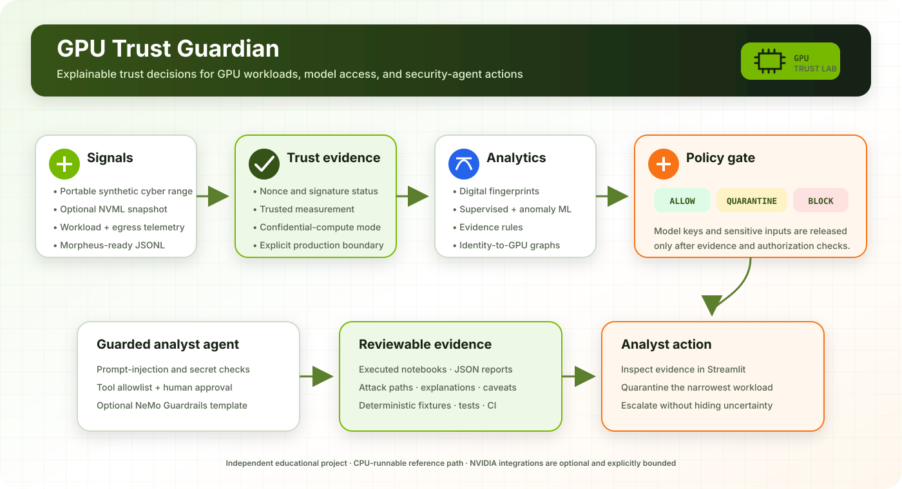
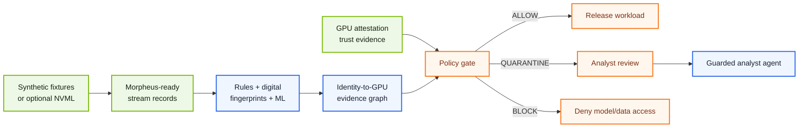
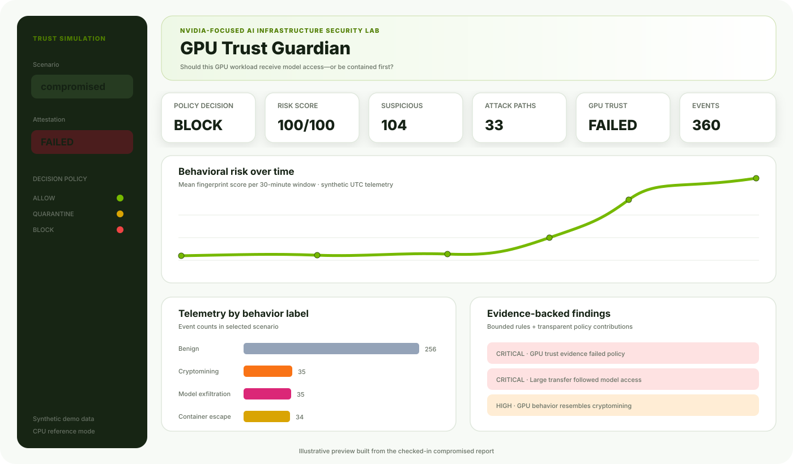

<p align="center">
  
</p>

<div align="center">

# GPU Trust Guardian

### NVIDIA-focused AI infrastructure security lab

**Verify GPU trust, detect suspicious workload behavior, trace attack paths, and protect the analyst agent before releasing sensitive models or data.**

[](https://github.com/VinayK88/gpu-trust-guardian/actions/workflows/ci.yml)
[](https://www.python.org/)
[](https://developer.nvidia.com/morpheus-cybersecurity)
[](https://docs.nvidia.com/morpheus/)
[](./LICENSE)

**CPU-runnable by default · Optional NVML/Morpheus/NeMo integrations · Synthetic and safe**

</div>

> Independent educational portfolio project. It is not affiliated with, sponsored by, or endorsed by NVIDIA.

## ELI5: what does this project do?

Imagine a GPU is a **very powerful robot** that will be trusted with a secret AI model.

Before giving the robot the secret, we ask four simple questions:

1. **Is this really our robot?** Attestation checks its identity and trusted configuration.
2. **Is it behaving normally?** Machine learning compares its activity with a known-good fingerprint.
3. **Where is it taking the secret?** An evidence graph connects the user, job, container, GPU, model, and destination.
4. **May the security assistant act?** Guardrails block prompt injection, secrets, unauthorized tools, and unapproved quarantine.

Then the policy makes one explainable decision:

| Decision | ELI5 meaning | Example action |
| --- | --- | --- |
| `ALLOW` | “The ID and behavior look acceptable.” | Continue normal monitoring |
| `QUARANTINE` | “Something is suspicious; pause and ask an analyst.” | Isolate the workload and preserve evidence |
| `BLOCK` | “A critical trust or behavior check failed.” | Do not release model keys or confidential data |

## What is actually built?



- A deterministic GPU telemetry cyber range with cryptomining, model-exfiltration, container-escape, and untrusted-hardware scenarios.
- A transparent digital-fingerprint scorer plus Random Forest and Isolation Forest evaluation.
- Evidence rules with concrete remediation and bounded event references.
- Identity → workload → container → GPU → model → destination attack paths.
- A policy engine that separates behavior detection from hardware attestation.
- An optional live NVML snapshot adapter and Morpheus-ready JSONL exporter.
- A runnable application-layer guard for analyst-agent prompts and tools.
- An optional NeMo Guardrails starter configuration.
- A chart-led Streamlit command center and four executed notebooks.
- Tests, Docker, CI, versioned fixtures, and machine-readable reports.

## Executed results

All numbers below come from checked-in synthetic fixtures and executed artifacts.

| Evidence | Result | Honest interpretation |
| --- | --- | --- |
| Secure demo | `ALLOW`, **0/100** risk across 360 events | The bounded happy path is internally consistent |
| Compromised demo | `BLOCK`, **100/100**, 104 suspicious events, 33 attack paths | Critical attestation, exfiltration, and container evidence triggered the gate |
| Random Forest | **82.1% F1**, 88.6% precision, 76.5% recall on 239 challenge events | Labels help, but intentionally evasive variants are still missed |
| Isolation Forest | **68.2% F1** on the same held-out population | Benign-only training detects novelty but gives up recall |
| Agent guard regression suite | **30/30** expected decisions; unguarded baseline 30% accurate | Exact deterministic policy cases pass; this is not a general jailbreak benchmark |

The ML corpus contains **1,320 synthetic events** across six scenario families. Attestation is deliberately excluded from the behavior classifier so hardware trust cannot leak the attack label.

## Analyst dashboard

<p align="center">
  
</p>

The default dashboard opens on the compromised scenario and immediately answers:

- Should this workload run?
- Did GPU attestation pass?
- How did behavioral risk change over time?
- Which attack families and evidence paths explain the decision?
- What should the analyst do next?

## Four executed notebooks

| Notebook | Main question | Visual evidence |
| --- | --- | --- |
| [01 · GPU Digital Fingerprinting](./notebooks/01_gpu_digital_fingerprinting.ipynb) | Can supervised and benign-only models identify suspicious GPU behavior? | Model comparison, confusion matrices, feature importance, scenario recall |
| [02 · Identity-to-GPU Attack Paths](./notebooks/02_identity_to_gpu_attack_paths.ipynb) | How did a user/workload reach a GPU, model, or external destination? | Graph composition, evidence network, terminal resources, path lengths |
| [03 · GPU Attestation Policy Gate](./notebooks/03_gpu_attestation_policy_gate.ipynb) | How should hardware trust and workload behavior combine? | Scenario risk, attestation ablation heatmap, policy contributions |
| [04 · Security-Agent Guardrail Eval](./notebooks/04_security_agent_guardrail_eval.ipynb) | Can the analyst agent resist bounded injection, secret, tool, and approval failures? | Guarded-vs-baseline metrics, coverage, decision matrix, approval cases |

Together they contain **29 executed code cells and 14 embedded figures**. Each notebook follows `tl;dr → context & methods → data → results → takeaways` and labels synthetic limitations next to the claims they qualify.

## Quick start

### 1. Install

```bash
git clone https://github.com/VinayK88/gpu-trust-guardian.git
cd gpu-trust-guardian
python -m venv .venv
source .venv/bin/activate
python -m pip install -e ".[app,notebooks,dev]"
```

### 2. Rebuild the evidence

```bash
python scripts/rebuild_artifacts.py
python scripts/build_notebooks.py
python scripts/execute_notebooks.py
python -m pytest -q
```

### 3. Run the dashboard

```bash
streamlit run dashboard/app.py
```

### 4. Scan the included scenarios

```bash
gpu-trust-guardian scan \
  --events data/secure_events.csv \
  --attestation attestations/trusted.json \
  --scenario secure \
  --output reports/my-secure-report.json

gpu-trust-guardian scan \
  --events data/compromised_events.csv \
  --attestation attestations/untrusted.json \
  --scenario compromised \
  --output reports/my-compromised-report.json
```

Example policy output:

```json
{
  "decision": "BLOCK",
  "risk_score": 100,
  "total_events": 360,
  "suspicious_events": 104,
  "attack_paths": 33,
  "attestation_trusted": false
}
```

## Agent-security examples

Benign, read-only request:

```bash
gpu-trust-guardian guard \
  "Summarize the evidence for incident 42" \
  --tool search_evidence
```

Containment without approval:

```bash
gpu-trust-guardian guard \
  "Quarantine the suspicious workload" \
  --tool quarantine_workload
```

The second request is blocked until `--human-approved` is supplied. The LLM may recommend an action; the deterministic application policy authorizes it.

## NVIDIA integration surfaces

| Surface | Included implementation | Production boundary |
| --- | --- | --- |
| [NVML](https://developer.nvidia.com/management-library-nvml) | Optional bounded live snapshot with dependency-injected tests | Add authenticated collection, asset inventory, buffering, and monitoring |
| [NVIDIA Morpheus](https://docs.nvidia.com/morpheus/) | Stable column schema and JSONL export for downstream ingestion | Deploy and benchmark a native GPU pipeline on governed infrastructure |
| [NVIDIA Attestation](https://docs.nvidia.com/attestation/index.html) | NRAS-shaped synthetic fixtures and fail-closed policy semantics | Perform real cryptographic verification, freshness, nonce binding, and RIM validation |
| [NeMo Guardrails](https://docs.nvidia.com/nemo/guardrails/about-nemo-guardrails-library/overview) | Starter input/output configuration plus a runnable app-layer reference guard | Add model-specific/adaptive red teaming and production identity context |

See [NVIDIA integration boundaries](./docs/nvidia-integration.md) for commands and non-claims.

## CPU-first, GPU-optional design

The project is intentionally reviewable on a laptop:

- `python scripts/rebuild_artifacts.py` requires no NVIDIA GPU.
- All notebooks execute against versioned synthetic CSV/JSON fixtures.
- The Streamlit app uses the same CPU reference pipeline and checked-in evidence.
- `pip install -e ".[nvidia]"` adds the optional `pynvml` adapter.
- `gpu-trust-guardian morpheus-export ...` creates an integration artifact without pretending a GPU benchmark occurred.

## Repository map

```text
gpu-trust-guardian/
├── src/gpu_trust_guardian/  # simulator, fingerprints, rules, graph, policy, guardrails
├── dashboard/app.py         # Streamlit security command center
├── notebooks/               # four executed ML/security investigations
├── data/                    # versioned synthetic telemetry and guardrail cases
├── attestations/            # trusted and failed demo evidence
├── reports/                 # secure, compromised, policy, and evaluation outputs
├── guardrails/              # optional NeMo starter configuration
├── docs/                    # NVIDIA integration boundaries
├── tests/                   # behavior, policy, guardrail, NVML, and adapter tests
└── scripts/                 # deterministic rebuild and notebook execution
```

## Threat model

| Asset | Representative threat | Control demonstrated |
| --- | --- | --- |
| GPU capacity | Unauthorized cryptomining | Behavioral fingerprint, power/utilization evidence, quarantine |
| Model weights | Exfiltration after model access | Egress evidence, attack path, fail-closed block |
| Host node | Privileged container escape behavior | Host-namespace evidence, containment recommendation |
| Confidential workload | Untrusted GPU/firmware state | Attestation gate before key/data release |
| Analyst workflow | Prompt injection or unauthorized tool use | Input checks, tool allowlist, human approval, audit result |

## What this project does **not** claim

- It does not cryptographically verify a real NVIDIA GPU; the checked-in attestation evidence is synthetic.
- It does not claim the synthetic ML metrics transfer to a production fleet.
- It does not execute ransomware, cryptominers, container escapes, or data exfiltration.
- It does not claim native Morpheus throughput without a GPU benchmark environment.
- It does not claim that a fixed regression suite establishes general agent safety.
- It does not replace an EDR, SIEM, admission controller, confidential-computing platform, or human incident commander.

## Why this strengthens a cybersecurity + AI profile

This repository demonstrates the intersection of:

- GPU and AI-infrastructure security;
- hardware-rooted trust and confidential-computing policy;
- streaming security telemetry and NVIDIA-aligned integration design;
- interpretable supervised, anomaly, and graph machine learning;
- model-weight protection and agentic security controls;
- reproducible evaluation, honest limitations, testing, CI, APIs/CLI, and analyst UX.

---

<div align="center">

Built for defensive research with safe synthetic evidence. **No live targets. No exploit payloads. No hidden production claims.**

</div>
